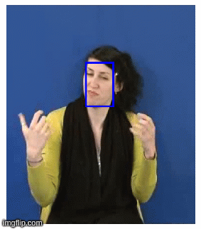
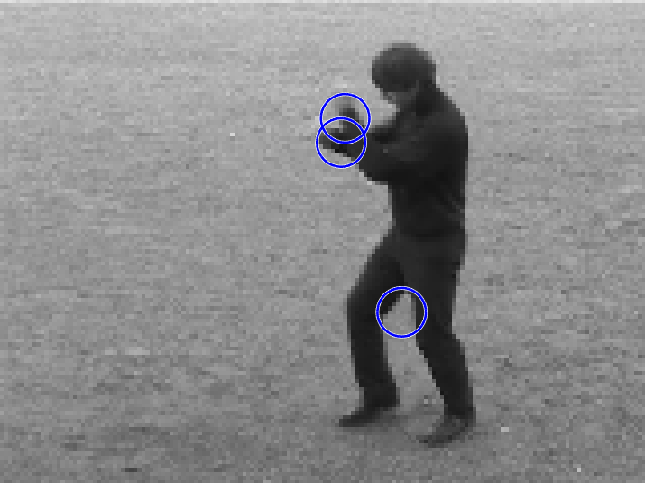

# vision

## Lab 1: Detection of Characteristics

### Edge Detection in Grayscale Images

### Interest Point Detection

### Image Classification via local descriptors

## Lab 2: Face Tracking using Optical Flow via the Lukas-Kanade Algorithm

### Human skin Detection

### Face Tracking

## Lab 3: Space-Time Interest Points and Video Feature Extraction

### Space-Time Interest Points

### Space-Time Feature Histograms

### Dendrograms for Action Classification